# Serverless-BBS / CFWorker BBS

纯基于 Cloudflare Worker + Pages 的类似 Discuz!3.5 程序.

**演示:** [https://serverless-bbs.anquanssl.com](https://serverless-bbs.anquanssl.com)

### 本地调试

安装 Wrangler: 如果您还没有安装 Wrangler (Cloudflare 的命令行工具)，请在您的终端中运行以下命令进行全局安装：


```bash
# 克隆代码
git clone https://github.com/serverless-bbs/serverless-bbs.git
cd serverless-bbs

# 全局安装 wrangler
sudo npm install -g wrangler

# 安装依赖

yarn


# 初始化D1数据库
yarn db:migrate

# 启动
yarn dev
```

### 线上部署

[](https://deploy.workers.cloudflare.com/?url=https%3A%2F%2Fgithub.com%2Fserverless-bbs%2Fserverless-bbs)


## 截图

<details>
<summary>前台截图</summary>

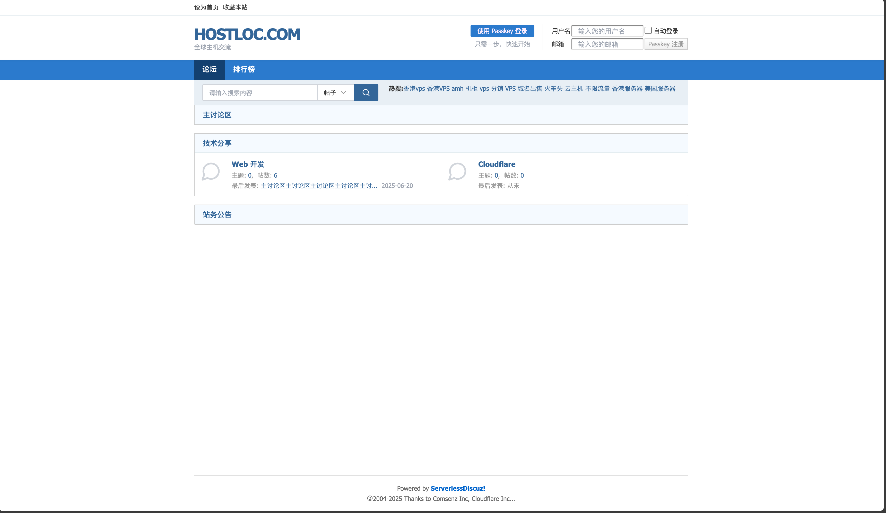
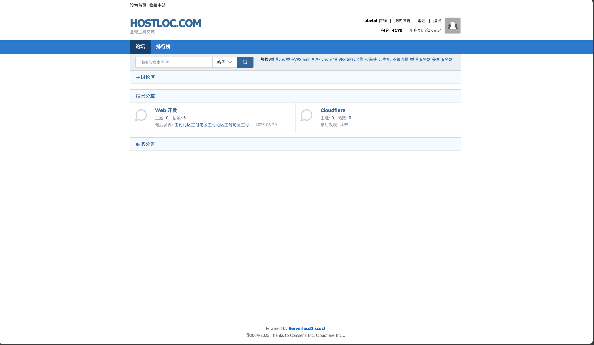
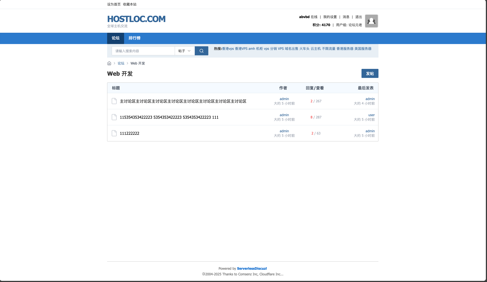
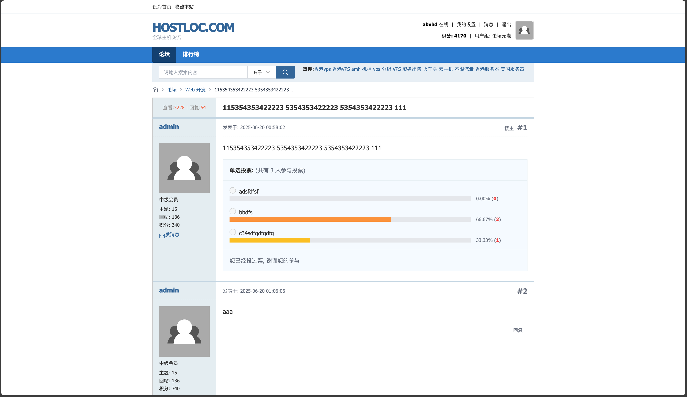
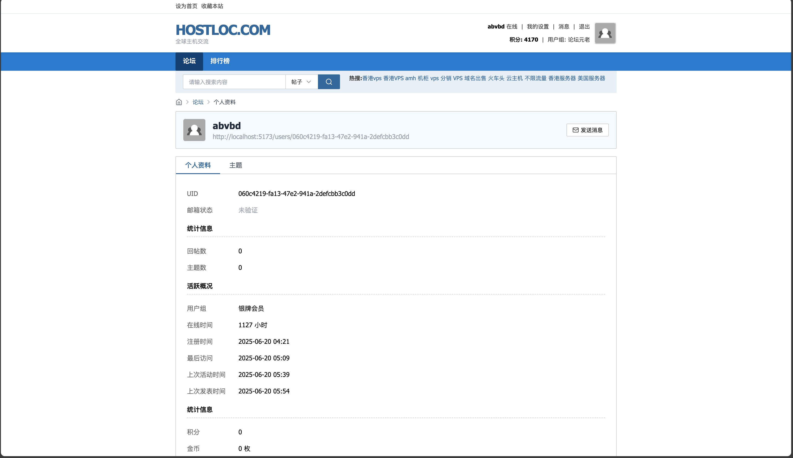
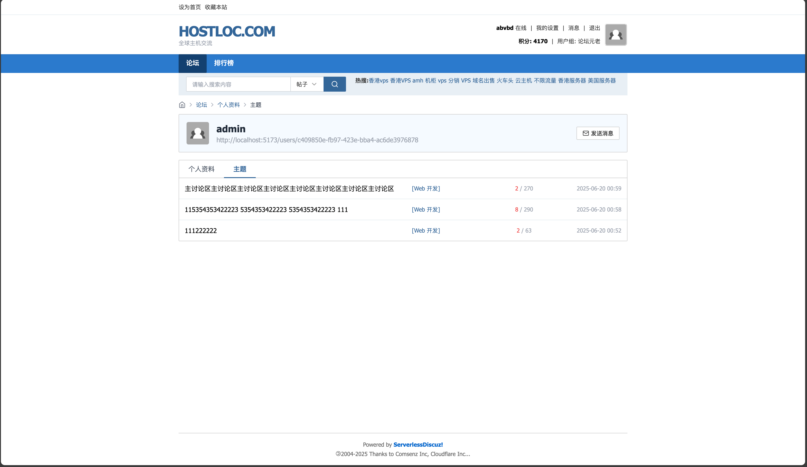
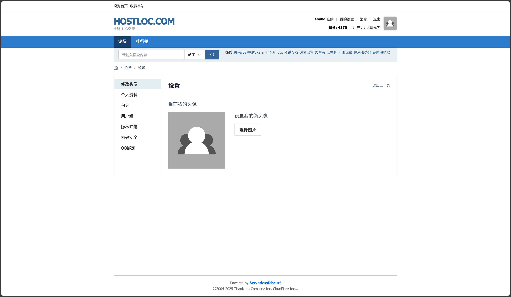
</details>

<details>
<summary>后台截图</summary>

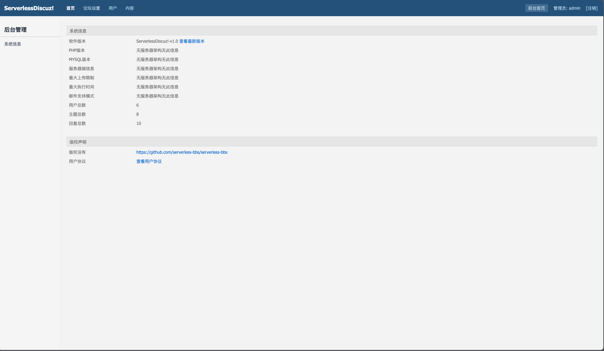
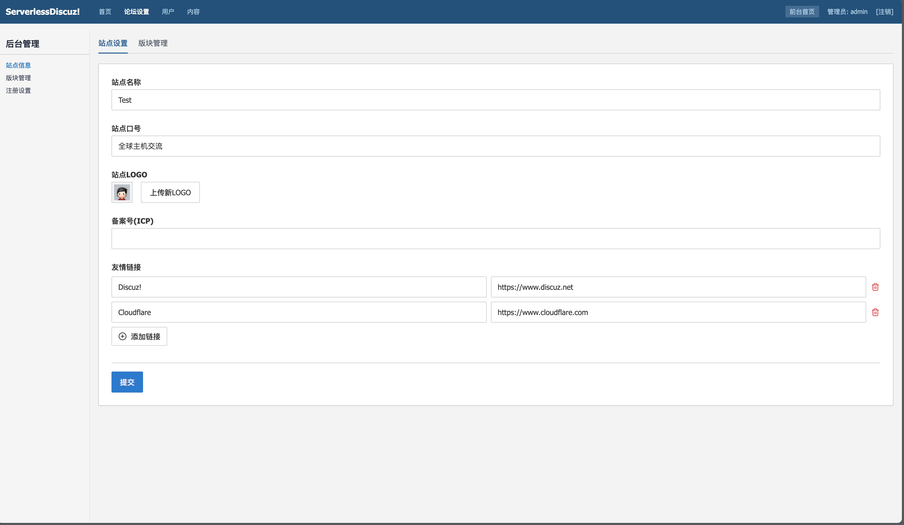
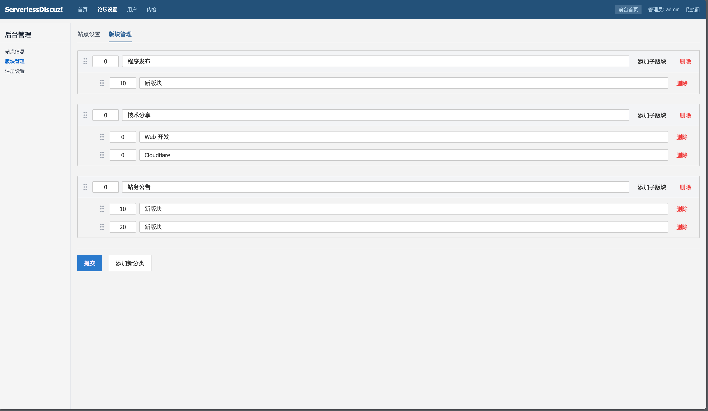
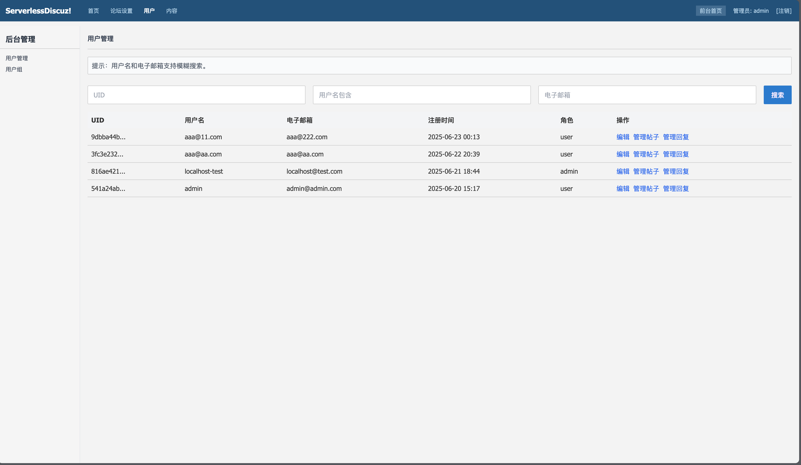
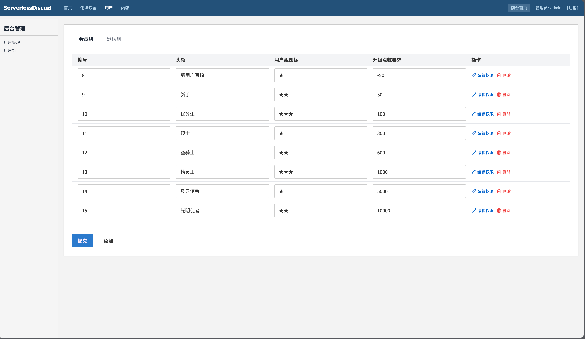

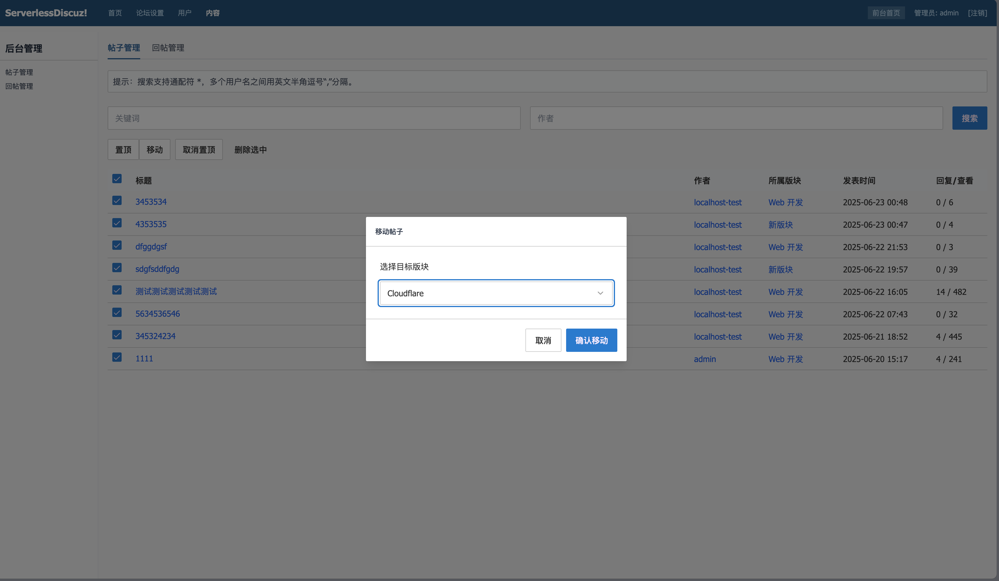
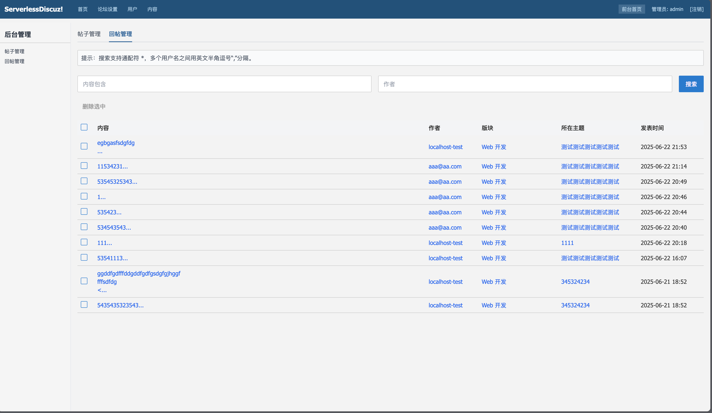
</details>


## 版本
版权不所有 (Copyleft) 授权。随意使用，但风险、后果与责任自担。